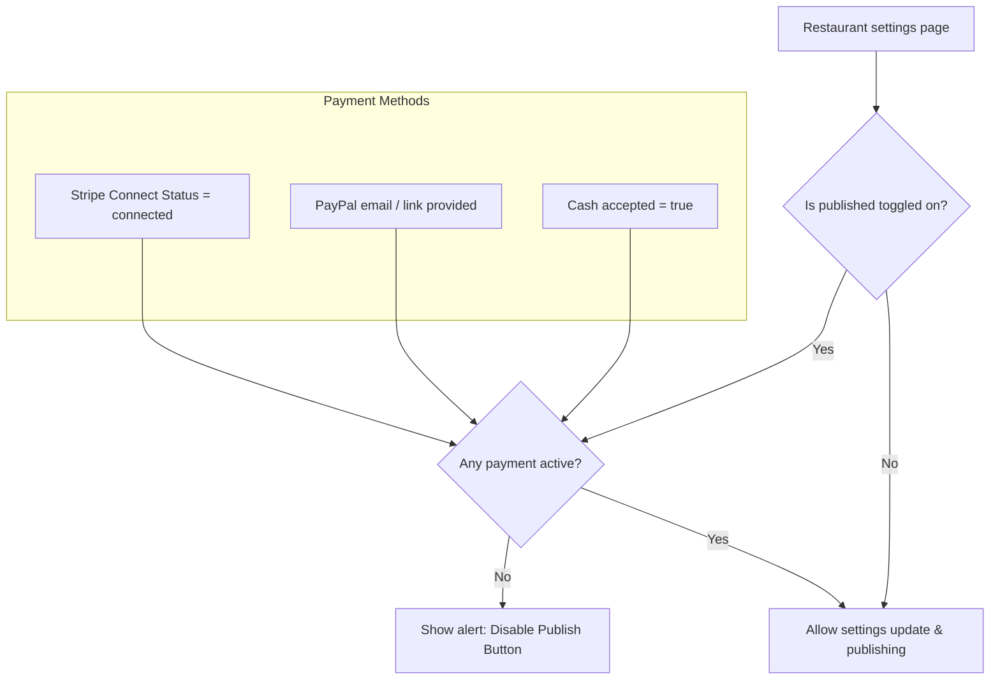

# Speisely Payments & Repository Brainstorming Guide

This document outlines the exact state of your code, what features were being built yesterday, the directory structures we discovered, and the key decisions you need to make to proceed safely without breaking your project.

---

## 1. What You Were Doing Yesterday (Payment Integration)

Yesterday, you worked on adding **PayPal, Cash, and Stripe** payment options to the restaurant settings in the Speisely dashboard. The goal was to give restaurants flexibility in how they accept payments and enforce that at least one method is configured before they can publish their storefront.

### Database Updates
A migration script was created to add fields to your database:
* **Migration:** `supabase/migrations/20260626100000_add_paypal_to_restaurants.sql`
* **Schema addition:**
  ```sql
  ALTER TABLE public.restaurants
  ADD COLUMN IF NOT EXISTS paypal_email text;
  ```

### Backend Logic
In the file [mutations.functions.ts](file:///C:/recoverd%20usb/Speisely%20Marketplace1/src/lib/restaurant/mutations.functions.ts), you updated the `updateMyRestaurantSettings` server function:
1. **Validation:** Configured the input validator (Zod) to parse:
   * `accepts_cash` (boolean)
   * `accepts_paypal` (boolean)
   * `paypal_email` (valid email format or null)
2. **Publishing Gate:** Added checks to prevent storefronts from publishing (`is_published: true`) unless:
   * `accepts_cash` is enabled, **OR**
   * `accepts_paypal` is enabled, **OR**
   * Stripe Connect is successfully connected (`stripe_connect_status === 'connected'`).

### Dashboard Settings UI
In the file [restaurant.tsx](file:///C:/recoverd%20usb/Speisely%20Marketplace1/src/routes/_authenticated/restaurant.tsx), you added:
1. **Interactive Switches:** Added toggles for Cash and PayPal in the settings page.
2. **PayPal link helper:** When PayPal is toggled on, it shows an input field for their PayPal email/PayPal.me link and a button directing them to `https://www.paypal.com/paypalme/my/profile` if they need to create one.
3. **Guardrails:** Added UI alerts and disabled the main publish button if no payment methods are turned on.



---

## 2. The Repository & Framework Discrepancy

While trying to link your workspace to GitHub today, we discovered a discrepancy between your local files and your online repository:

| Detail | Local Folder (`Speisely Marketplace1`) | Online Repository (`bookacook-pro`) |
| :--- | :--- | :--- |
| **Framework** | **Vite + React / TanStack Start** | **Next.js** |
| **Routing** | TanStack Router (`src/routes/...`) | Next.js App Router (`app/...`) |
| **File Structure** | Everything is under `src/` | Root-level `app/`, `components/`, `lib/` |
| **Origin** | Generated by Lovable.dev (modern SPA architecture) | Original codebase |

### What this means:
* The local folder `Speisely Marketplace1` is a complete migration of the application to a new, modern React architecture.
* The GitHub repository `bookacook-pro` still hosts the old Next.js files.
* Yesterday's git commands failed because your local folder was not tracked by Git (it had no `.git` folder). 
* Now that we have copied the `.git` folder, Git shows all Next.js files as "deleted" and your TanStack files as "untracked."

---

## 3. Decisions & Things to Approve (Brainstorming Items)

Before we start coding or pushing to GitHub, you need to decide on the following options:

### Question A: How do we save the new TanStack Start codebase to GitHub?

Choose one of the following approaches:

> [!IMPORTANT]
> **Option 1 (Recommended): Replace the main branch**
> If you have fully transitioned from Next.js to the new Lovable.dev framework (TanStack Start) and have no intention of using the Next.js version anymore, we should commit the local files and push them to `main`. This will replace the old Next.js files on GitHub with your new code.

> [!NOTE]
> **Option 2: Push to a separate branch**
> If you want to keep the Next.js version on the `main` branch just in case, we can push your local folder to a new branch (e.g. `lovable-migration`). This keeps both versions safe on GitHub.

> [!NOTE]
> **Option 3: Create a brand new repository**
> If you want them completely isolated, you can create a new repository on GitHub (e.g. `speisely-tanstack`), and we will push this project there.

---

### Question B: Database Migration Approval
Have you run the new SQL migration on your production Supabase database?
* If not, the database does not yet have the `paypal_email` column, which will cause errors when the backend tries to query or update it.
* **To fix this:** We need to run the migration script in your Supabase SQL editor.

---

### Question C: What should we work on next?
Once the code is safely version-controlled, do you want to:
1. **Run the app locally** (`npm run dev`) to test the PayPal/Cash/Stripe setting toggles?
2. **Double check the checkout flow** to ensure customers actually see the PayPal, Cash, and Stripe options when they try to pay for an order?
3. **Deploy** the new TanStack Start application to Vercel/Netlify?
